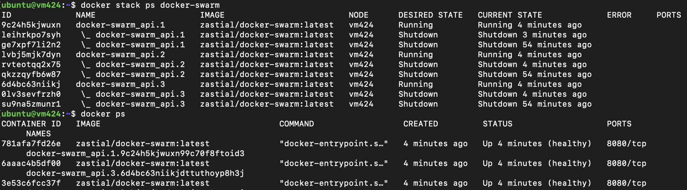
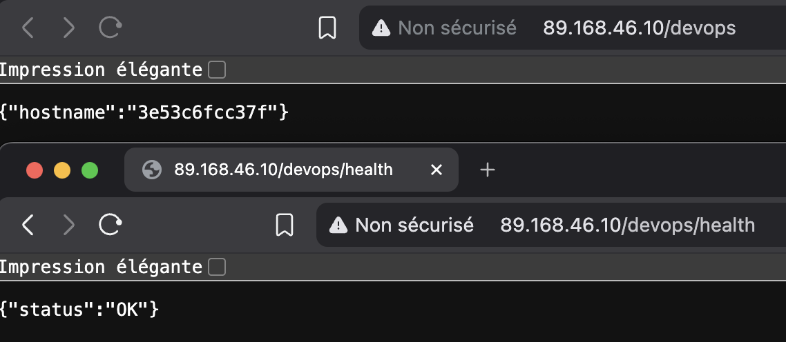

# docker_swarm_ci_cd_project

Author: Alexandre CAROL

# Projet

## Architecture

- Une API Node.js expose deux endpoints: `GET /` pour le hostname du conteneur et `GET /health` pour les probes.
- L'application écoute sur `0.0.0.0` afin d'être joignable depuis l'extérieur du conteneur.
- Le port est configurable via la variable d'environnement `PORT`.
- Le déploiement cible Docker Swarm avec un accès distant au manager via SSH depuis la CI.
- Flux simplifié: CI/CD -> manager Swarm -> service Docker -> API Node.js.

## Installation

DEV LOCAL (sans Docker) :
```
npm install && npm run start
```

DEV DOCKER :
```
docker swarm init

docker stack deploy \           
    -c docker-stack.yml \
    --with-registry-auth \
    docker-swarm
```

Vérifier l'accès: `curl http://<host>:<port>/` et `curl http://<host>:<port>/health`.

## Choix techniques et justifications

- **Express**: simple, léger, suffisant pour exposer deux routes HTTP.
- **Morgan pour les logs HTTP**: solution simple pour obtenir une observabilité minimale sans ajouter de code de logging complexe.
- SSH pour la CI: Plus simple à mettre en place que TLS pour Docker, et permet de limiter les risques en cas de compromission de la clé.

## Risques / sécurité

- Exposer Docker en TCP sans TLS est dangereux car cela donne un accès root à la machine. C'est pourquoi j'ai choisi une approche SSH pour la CI.

- L'utilisation de secrets GitHub pour stocker la clé SSH dédiée à la CI permet de limiter les risques en cas de compromission.

- Une solution plus sécurisée serait d'utiliser watchtower ou un webhook inversé pour éviter d'exposer un port sur le manager.

## Preuve de fonctionnement

Capture d'écran de `docker stack ps` montrant les services en cours d'exécution dans Swarm, confirmant que l'application est déployée et fonctionnelle.


Capture d'écran de l'application déployée sur ma VM.

PS: Si on recharge la page plusieurs fois, on voit que le hostname change.

# Partie A — API Node.js

## Questions

### Comment récupérez-vous le hostname dans Node.js ?

En Node.js, on peut utiliser le module `os` natif :

```javascript
const os = require('os');
const hostname = os.hostname();
```

Avec Docker :
```javascript
const hostname = process.env.HOSTNAME;
```

### Quelle différence entre “listening on [localhost](http://localhost)” et “0.0.0.0” dans un conteneur ?

Avec **localhost (127.0.0.1)**, on écoute uniquement sur l'interface interne du conteneur. L'application est inaccessible depuis l'extérieur du conteneur.


Avec **0.0.0.0**, on écoute sur toutes les interfaces réseau du conteneur, y compris celles exposées par Docker/Kubernetes. Cela permet à l'application d'être accessible depuis l'extérieur du conteneur.

# Partie B — Conteneurisation Docker

## Questions

### Quels fichiers doivent absolument être ignorés ? Pourquoi ?

- **node_modules/** : Les dépendances sont réinstallées dans l'image Docker, donc on n'a pas besoin de les copier. Cela réduit la taille de l'image et évite les problèmes de compatibilité.

- **.git/**, **.vscode/**, **.idea/** : Ces dossiers contiennent des fichiers de configuration spécifiques au développement local et ne sont pas nécessaires dans l'image de production.

- **.env**, **.env.local** : Ces fichiers contiennent des secrets et des configurations spécifiques à l'environnement de développement. Ils ne doivent pas être inclus dans l'image pour des raisons de sécurité.

### Comment valider que votre image finale ne contient pas d’artefacts de dev ?

1. Explorer le filesystem à la main :
   ```bash
   docker run --rm -it <image_name> sh
   ```
   Puis vérifier que les dossiers/fichiers ignorés ne sont pas présents.

2. Dive — inspection layer par layer
    ```bash
    dive <image_name>
    ```
    Permet de voir le contenu de chaque couche de l'image et de vérifier que les fichiers ignorés ne sont pas inclus.

3. docker inspect pour les métadonnées
    ```bash
    docker inspect <image_name>
    ```
    Permet de vérifier les variables d'environnement, les ports exposés, etc...

# Partie C — Registry d’images

## Questions

### Quelle stratégie de tags adoptez-vous : latest, SHA, semver ?

On tag chaque image avec latest pour la commodité et avec le SHA Git pour garantir que chaque déploiement est traçable et reproductible jusqu'au commit exact.

### Pourquoi un tag immuable est préférable pour un déploiement fiable ?

Un tag immuable garantit que l'image déployée est exactement celle qui a été testée et validée.

# Partie D — Accès distant au cluster Swarm

### Architecture
<pre>
    GitHub Actions
        │
        │ SSH
        ▼
    VM Manager Swarm
        │
        │ docker service update
        ▼
    docker-swarm-api (container)
        │
        │ :8080
        ▼
    Application Node.js
</pre>

### Mécanisme d'authentification

Mon implémentation est **Docker context via SSH** :

- Un user dédié `devopsci` est créé sur mon manager/ma VM, membre du groupe `docker`
- Une paire de clés ed25519 est générée spécifiquement pour la CI
- La clé privée est stockée dans les secrets GitHub (SWARM_SSH_KEY)
- La CI crée un contexte Docker pointant sur ssh://devopsci@<SWARM_IP> et contrôle Swarm à distance

### Ports exposés

| Port | Protocole | Usage |
|------|-----------|-------|
| 22 | TCP | SSH — accès CI au manager |
| 8080 | TCP | HTTP — application Node.js |

### Risques & Mitigations

| Risque | Mitigation |
|--------|------------|
| Clé SSH compromise | Clé dédiée CI, révocable indépendamment sans impacter les autres accès |
| Accès trop large au manager | `devopsci` limité au groupe `docker`, pas de sudo |
| Image compromise sur Docker Hub | Tags SHA Git — chaque déploiement est traçable |
| Container instable en prod | Healthcheck|

## Questions

### Pourquoi exposer Docker en TCP sans TLS est dangereux ?
N'importe quelle personne qui peut joindre le port 2376 a un accès root complet à ma machine.

### Quelle différence entre “le runner atteint le manager” et “le manager atteint le runner” ?

**Le runner atteint le manager (implémentation actuelle)**

La CI initie la connexion vers le manager. Le manager doit exposer un port (22). \
Si la clé SSH est compromise → accès au manager


**Le manager atteint le runner (Watchtower, webhook inversé)**

C'est le manager qui initie la connexion vers l'extérieur, aucun port n'est exposé sur le manager.
La CI ne peut pas push quoi que ce soit.

# Partie E — Déploiement Swarm

## Questions

### Comment Swarm gère-t-il un rolling update ?
Swarm remplace les replicas un par un. Pour chaque replica, il démarre le nouveau, attend que le healthcheck passe, puis tue l'ancien. Les autres replicas continuent à servir le trafic pendant ce temps.

### Que se passe-t-il si le healthcheck échoue pendant l’update ?
Si le healthcheck échoue, Swarm considère le nouveau conteneur défaillant. Il arrête le processus de mise à jour, laisse les anciens conteneurs en place et affiche une erreur. L'application reste donc disponible même avec une erreur.

# Partie F — GitHub Actions CI/CD

## Questions

### Comment éviter d’afficher des secrets dans les logs ?
Par défaut, GitHub Actions masque automatiquement les valeurs des secrets.* dans les logs.

### Comment valider automatiquement que le service est “UP” après deploy (smoke test) ?
L'idée est d'attendre que le service soit réellement Running avant de valider. Ensuite, on peut check l'état du service avec `docker service ps` ou faire une requête HTTP vers /health.